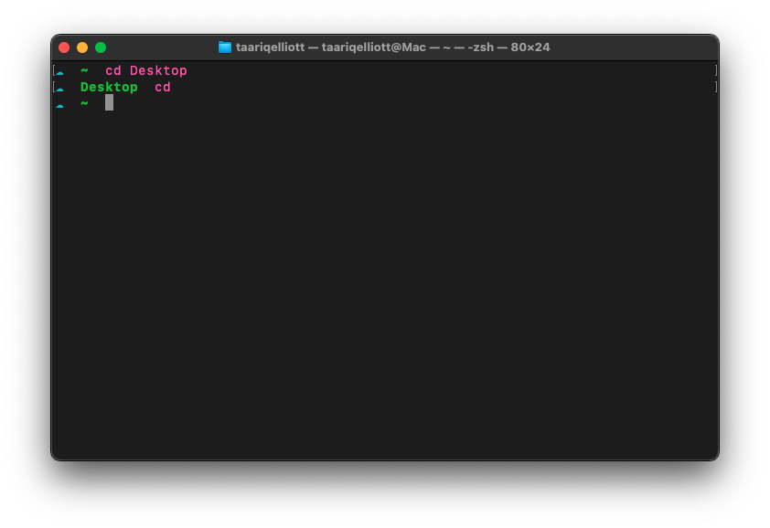
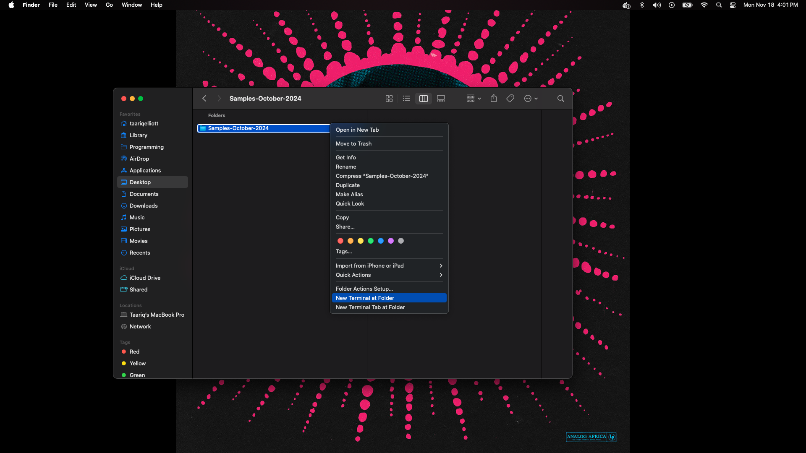
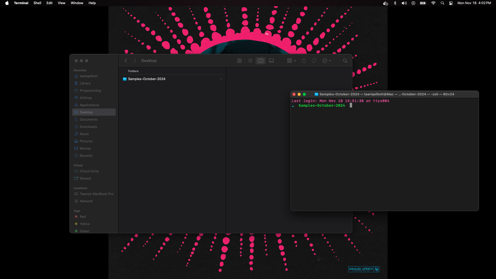
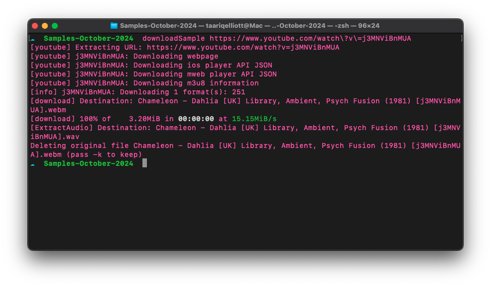
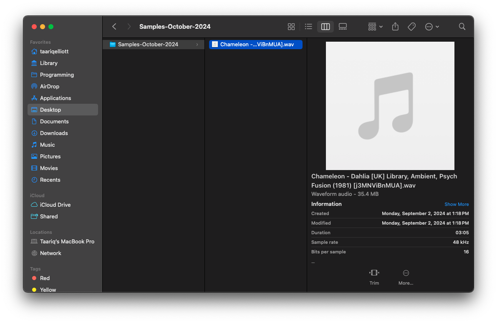

# MAC INSTRUCTIONS

#### 1. Install Homebrew and Oh My Zsh

**\*IMPORTANT: (IF YOU MESS UP A COMMAND AND NEED TO START ON A NEW LINE JUST PRESS `CTRL` + `C` **or** `CMD` + `K` **or** to clear the terminal type `clear` then enter)\***

**Oh My Zsh**: A framework for managing your Zsh shell configuration, making it easier to customize.
**Homebrew**: A package manager for macOS that simplifies installing software and dependencies.

Run the following commands to install Oh My Zsh and Homebrew from the terminal (Make sure you're working in the root directory of the terminal by typing `cd` then pressing enter. It should look like this):


After you're in the root enter the below commands into the terminal one at a time. If you're prompted to confirm anything just press 'y' or 'enter' depending on what it asks for.

**ohmyzsh:**

```powershell
sh -c "$(curl -fsSL https://raw.githubusercontent.com/ohmyzsh/ohmyzsh/master/tools/install.sh)"
```

_then_

**homebrew:**

```powershell
/bin/bash -c "$(curl -fsSL https://raw.githubusercontent.com/Homebrew/install/HEAD/install.sh)"
```

---

**Next, we need to install Python and pip using Homebrew.**

#### 2. Install Python and pip using Homebrew

**Python**: A popular programming language used for various applications.
**pip**: A package manager for Python that makes it easy to install and manage Python libraries.

Run this command from the terminal to install Python:

```bash
brew install python
```

---

**Next, we need to install ffmpeg for media processing.**

#### 3. Install ffmpeg using Homebrew

**ffmpeg**: A tool for converting, recording, and streaming audio and video.

Run this command from the terminal to install ffmpeg:

```bash
brew install ffmpeg
```

---

**Next, we need to install yt-dlp to download videos or audio from the web.**

#### 4. Install yt-dlp using Homebrew

**yt-dlp**: A command-line utility to download videos and audio from YouTube and other platforms.

Run this command from the terminal to install yt-dlp:

```bash
brew install yt-dlp
```

---

**Next, we need to add a custom command to your `.zshrc` file.**

#### 5. Add a custom command to the `.zshrc` file

A custom command simplifies executing yt-dlp with your preferred settings.

1. Open the `.zshrc` file in a text editor from the terminal by entering the below command:

```bash
   open ~/.zshrc
```

2. Scroll to the bottom and paste the following (customize the function name if needed). I named it `downloadSample` for the context of the video but you can name it anything you want like `sample` or `convertAudio` **but make sure you pay attention to the casing of the function name. In the terminal it should be the same name & casing**:

```powershell
   downloadSample() {
   yt-dlp -x --audio-format wav --audio-quality 0 "$@"
   }
```

**_After you paste the above at the bottom of the `.zshrc` file, SAVE THE FILE with `CMD + S` or from the TextEdit application menu._**

---

**Next, we need to reload the `.zshrc` file.**

#### 6. Reload the `.zshrc` file to apply changes

Run the following command from the terminal to reload your `.zshrc` file:

```bash
source ~/.zshrc
```

---

#### 7. Verify the installations

**Next, we need to verify the installations.**

Run the following commands to ensure everything is installed correctly:
python3 --version
pip3 --version
ffmpeg -version
yt-dlp --version

---

#### 8. Time To Test!

FIRST - Change into whatever directory you want the sample to be in from the terminal. There are multiple ways of doing it:

1. `cd Desktop` or `cd Documents` or `cd Music/Samples-March` but make sure the folder exists. It's up to you where you want to download the samples.
   **_OR_**
2. Right click the target folder and click the option at the bottom for `New Terminal at Folder`. A new terminal window in that directtory will pop up.
   
   

FINALLY - Run the command!

I named mine `downloadSample` so I would enter the below in the terminal

**example terminal input:**
_name of custom function + link to the video_

```bash
downloadSample https://www.youtube.com/watch?v=j3MNViBnMUA
```

If everything was installed properly, then you should see some output in the terminal that looks like this and the sample inside of the folder:


